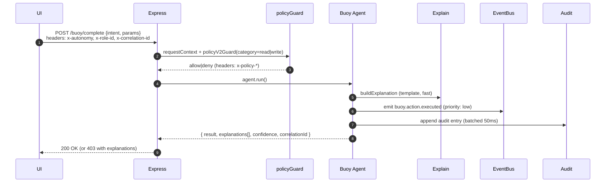

# Workbuoy — Architecture (delta-mode snapshot)

## Request flow — `/buoy/complete`


## Headers & contracts
- `x-autonomy: 0|1|2`, `x-role-id`, `x-correlation-id` (optional; server will generate)
- Responses include `correlationId` and `explanations[]` on deny/degrade.

## Rails tags in code
Use these machine-readable comments:
```ts
// RAIL:ENTRYPOINT <name>
// RAIL:SIDE_EFFECT <what>
// RAIL:RETURN <shape>
```
