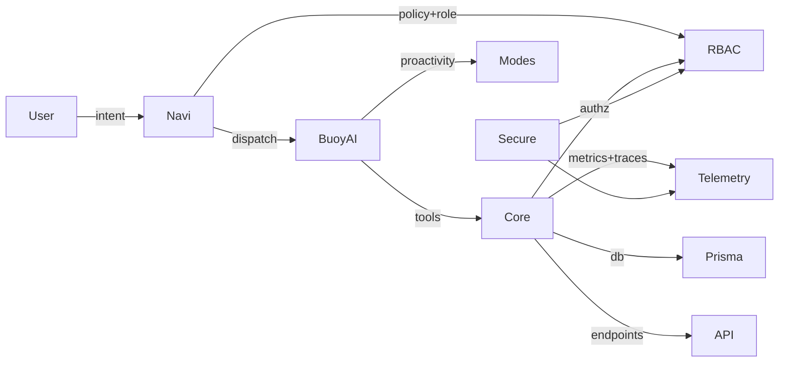
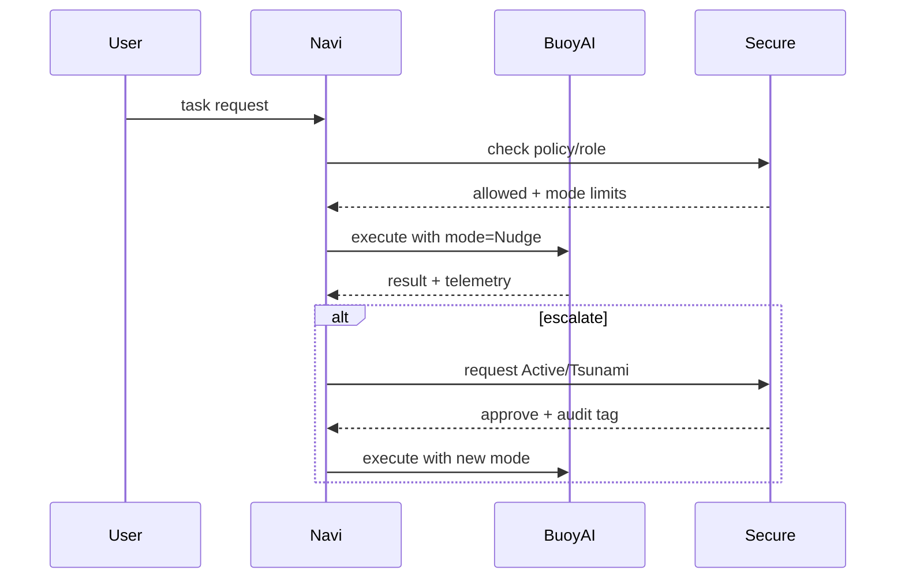

# Workbuoy Architecture: Core / Flex / Secure + Navi, Buoy AI, Roles, and Proactivity

This document is the on-ramp for new GPT developers. It explains how the platform fits together, where things live in the repo, and how to ship safely under strict CI/compliance.

## 1) Core (Foundation)
**What it is:** The stable backend substrate (RBAC, telemetry, metrics, repo guards, CI policy, Prisma DB client).
**Why it matters:** repeatable builds, typed boundaries, observability-by-default.
**Key capabilities**
- RBAC & policy: authorization helpers, middleware, and routes.
- Telemetry & Metrics: OpenMetrics-compatible endpoint, default registry, request/response hooks.
- Repo governance & CI: typecheck gates, container build-and-scan, Trivy, dependency pinning.
- Data access: Prisma client generation, DB migrations (apps/backend/prisma).

**Code map (adjust paths if our repo differs):**
- `apps/backend/` – primary service
- `packages/backend-rbac/` – RBAC library
- `packages/backend-telemetry/` – tracing/metrics helpers
- `packages/backend-metrics/` – metrics router + helpers
- `apps/backend/prisma/` – schema & client

## 2) Flex (On-Demand Core)
**What it is:** Core features on-demand: per task, or per time window (hour/day/week). Think “vikar-/konsulent-AI.”
**How to use:** Spin up only what a given task needs (router/middleware/modules) and tear down after completion.
**Modes:** Invisible background -> soft nudge -> active intervention -> “tsunami” (full engagement) with safe-guards.

## 3) Secure (Compliance)
**What it is:** The compliance layer (GDPR, AI Act, security hardening) + operational evidence (audit trails).
**Included now:**
- JWT/SSO hardening (importSPKI to KeyLike, allowed algs)
- Audit hooks & correlation IDs
- Trivy scans in CI for images
- Typed guards for headers/env/params (`require*` utils, `assertDefined`)
**AI Act alignment (starter checklist):**
- Transparency: telemetry + “AI performing action” signaling
- Risk classification: default to high-risk if used for work decisions
- Human oversight: explicit override points in routers/services
- Data governance: data lineage notes in telemetry + secure config

## 4) Navi (Orchestration)
**What it is:** The routing/orchestration brain. It routes tasks to Buoy AI, applies role/policy, escalates proactivity modes.
**Interfaces:** 
- Inputs: events, webhooks, scheduled jobs, user intents
- Outputs: task execution, router mounting, message emission
- Policies: role library + RBAC drive what’s allowed

## 5) Buoy AI (Reasoning & Tools)
**What it is:** AI operator that performs tasks with tool use, context windows, and guardrails.
**Model wiring:** Default GPT-4 class models (or equivalent) via server-side adapters. 
**Behaviors:**
- Workflows: single task, chain-of-tasks, or long-running session
- Safety: deterministic escalation gates (human-in-the-loop checkpoints)
- Telemetry: span per tool call; correlation ID propagation

## 6) Role Library (Capabilities & Policies)
**What it is:** Reusable, typed “roles” that bundle capabilities & constraints (e.g., CRM-importer, Metrics-auditor).
**Design:**
- Each role defines: permissions, tools/APIs, proactivity limits, audit tags.
- Bound to RBAC scopes and used by Navi to decide runnable actions.
- Current definitions live under `packages/roles-data/` alongside role manifests.

## 7) Proactivity Modes (Invisible → Tsunami)
**What it is:** A graded scale controlling how assertive the system is.
**Levels:**
- Invisible: background-only, no user-visible actions
- Nudge: suggestions/prompts only
- Active: performs actions with undo/approval
- Tsunami: full autonomy within strict role/RBAC limits
**Implementation hooks:** 
- Mode gating in Navi before dispatch
- Telemetry flagging for each escalation
- Human override points always present

## 8) Minimal Developer Workflow (MVP)
**Goal:** Get productive fast under strict CI.
1. `npm ci` in root; ensure typecheck passes locally.
2. Start backend (dev) and hit health/metrics endpoints.
3. Enable a role for a small task; wire a Navi route; call into Buoy AI.
4. Add telemetry spans & metrics counters for your feature.
5. Run container build-and-scan; check Trivy results; iterate.

## 9) Roadmap (MVP → Beta → Launch)
- **MVP (internal pilot)**: green CI, metrics/telemetry stable, first GPT-4 job executed via Buoy AI + Navi, one production-grade role.
- **Beta (external pilot)**: multiple roles, on-demand Flex tasks, tighter AI Act docs.
- **Launch**: role marketplace, full governance pack, audit-ready evidence exports.

## 10) Diagrams

### System Context

### Proactivity Escalation

## 11) Repo Pointers
Backend app: `apps/backend/`

RBAC: `packages/backend-rbac/`

Telemetry/Metrics: `packages/backend-telemetry/`, `packages/backend-metrics/`

Prisma: `apps/backend/prisma/`

Docs (you are here): `docs/architecture/workbuoy-architecture.md`

## 12) Contributing (for GPT developers)
Start with small, typed changes; run `npm run typecheck`.

Add telemetry spans and metrics counters by default.

Keep RBAC checks at the edge (middleware/routers).

For new roles: define capabilities, proactivity ceiling, audit tag.

For Buoy AI tasks: isolate tool calls, propagate correlation IDs.
